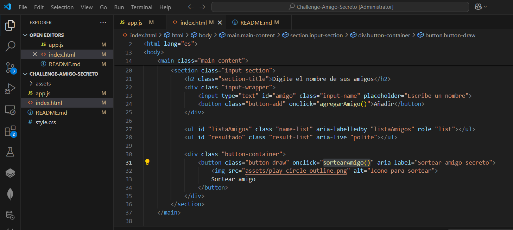

<h1>Challenge <i>"Amigo Secreto"</i></h1>

<h2>Descripción del Challenge Amigo secreto (Alura)</h2>

En este desafío, desarrollarás una aplicación que permita a los usuarios ingresar nombres de amigos en una lista para luego realizar un sorteo aleatorio y determinar quién es el "amigo secreto".

El usuario deberá agregar nombres mediante un campo de texto y un botón "Adicionar". Los nombres ingresados se mostrarán en una lista visible en la página, y al finalizar, un botón "Sortear Amigo" seleccionará uno de los nombres de forma aleatoria, mostrando el resultado en pantalla.

<h2>Fucionalidades:</h2>

Agregar nombres: Los usuarios escribirán el nombre de un amigo en un campo de texto y lo agregarán a una lista visible al hacer clic en "Adicionar".

Validar entrada: Si el campo de texto está vacío, el programa mostrará una alerta pidiendo un nombre válido.

Visualizar la lista: Los nombres ingresados aparecerán en una lista debajo del campo de entrada.

Sorteo aleatorio: Al hacer clic en el botón "Sortear Amigo", se seleccionará aleatoriamente un nombre de la lista y se mostrará en la página.

<h1>Aquí comienza el desafío...</h1>
<h2>Crear un repositorio en GitHub</h2>

Como primero paso creamos un repositorio público en GitHub donde vamos a guardar los archivos de nuestro proyecto llamado <i>"Amigo Secreto"</i>. Este proyecto es un Challenge que tenemos que cumplir para continuar con el curso de ONE - Alura Latam, llamado "Principiante en Programación G8 - ONE".

<b>Principiante en Programación G8 - ONE</b> Es una guía básica inicial para quien desea entrar en el universo de programación y comenzar con la creación de páginas web utilizando los lenguajes populares de HTML, CSS y JavaScript.

<h2>Agregar un Readme</h2>

El README es esencial para comunicar cómo utilizar y entender un proyecto. Este archivo es el punto de referencia inicial para cualquier persona interesada en entender tu proyecto. Un buen README incluye información sobre la instalación, dependencias, cómo ejecutar el proyecto, y posibles problemas o soluciones.

Como reto adicional, crea un README para tu proyecto de "Amigo Secreto" detallando sus funcionalidades, incluyendo capturas de pantalla o videos que muestren cómo agregar nombres y realizar el sorteo. Esta práctica mejorará la documentación, y hará que tu proyecto sea más accesible y profesional para la comunidad.

<h2>Estructura del Proyecto</h2>

La siguiente imagen muestra como está estructurado este proyecto. 
Contamos con 3 archivos principales:

<ul>index.html</ul> Archivo HTML. Contiene la estructura o armazón de nuestra página web.
<ul>app.js</ul> Archivo de JavaScript. Aquí se definen las variables y funciones que dan vida al desafío.
<ul>styles.css</ul> Hoja de estilos. Aquí se definen la estética de nuestra página.

y una carpeta donde tenemos de forma local las imágenes que se visualizaran en nuestra página web del Challenge <i>Amigo Secreto</i> llamada "assets".

<h2>Descripción del archivo HTML</h2>

<h2>Descripción del archivo JS</h2>

<h2>Descripción del archivo CSS</h2>

