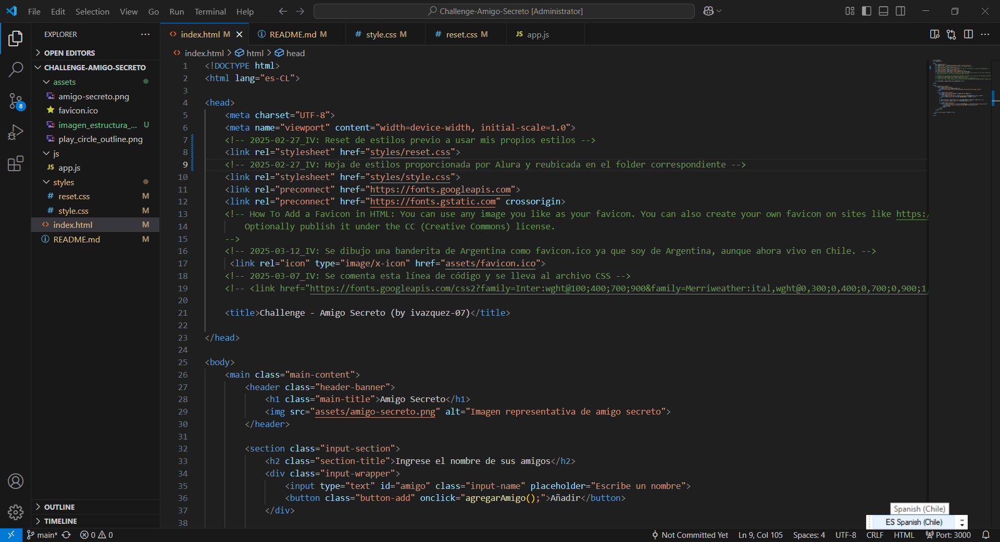
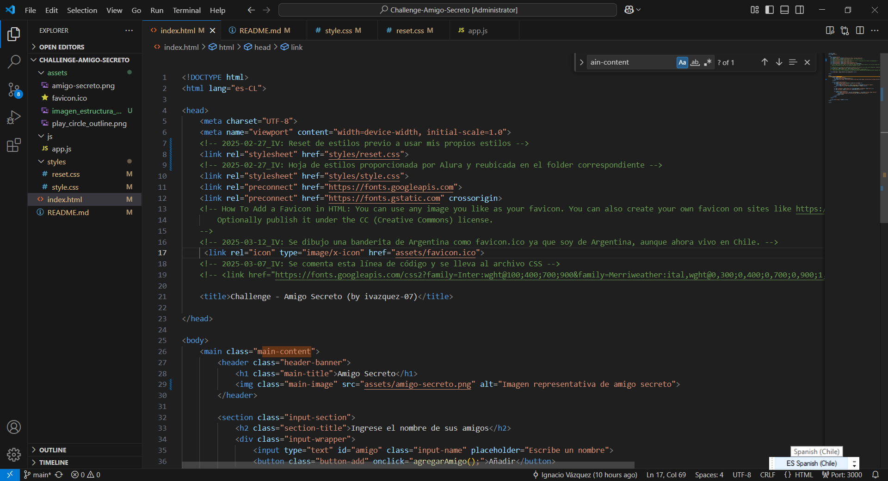
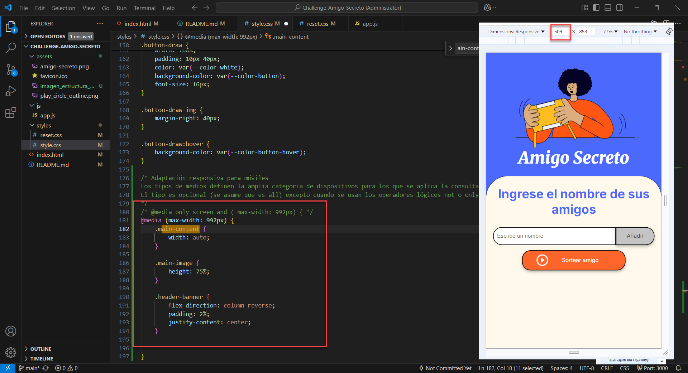
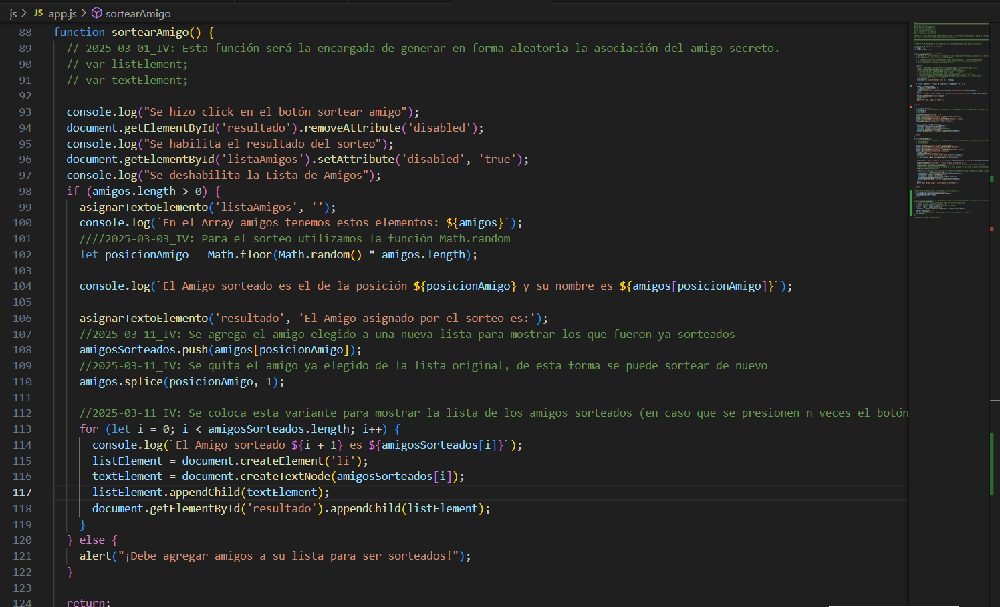

<h1>Challenge <i>"Amigo Secreto"</i></h1>

<h2>Descripción del Challenge Amigo secreto (Alura)</h2>

En este desafío, desarrollarás una aplicación que permita a los usuarios ingresar nombres de amigos en una lista para luego realizar un sorteo aleatorio y determinar quién es el "amigo secreto".

El usuario deberá agregar nombres mediante un campo de texto y un botón "Adicionar". Los nombres ingresados se mostrarán en una lista visible en la página, y al finalizar, un botón "Sortear Amigo" seleccionará uno de los nombres de forma aleatoria, mostrando el resultado en pantalla.

<h2>Foco en la lógica</h2>

El objetivo principal de este desafío es desarrollar habilidades en lógica de programación, por eso hemos proporcionado el HTML y CSS ya preparados. De esta manera, puedes enfocarte exclusivamente en construir la lógica del código JavaScript, aplicando conceptos clave como funciones, arrays, condicionales y variables. Esto te permitirá centrarte en resolver el problema y mejorar el razonamiento lógico, sin preocuparse por la estructura visual del proyecto.

<h2>Fucionalidades:</h2>

Agregar nombres: Los usuarios escribirán el nombre de un amigo en un campo de texto y lo agregarán a una lista visible al hacer clic en "Adicionar".

Validar entrada: Si el campo de texto está vacío, el programa mostrará una alerta pidiendo un nombre válido.

Visualizar la lista: Los nombres ingresados aparecerán en una lista debajo del campo de entrada.

Sorteo aleatorio: Al hacer clic en el botón "Sortear Amigo", se seleccionará aleatoriamente un nombre de la lista y se mostrará en la página.

<h1>Aquí comienza el desafío...</h1>
<h2>Crear un repositorio en GitHub</h2>

Como primero paso creamos un repositorio público en GitHub donde vamos a guardar los archivos de nuestro proyecto llamado <i>"Amigo Secreto"</i>. Este proyecto es un Challenge que tenemos que cumplir para continuar con el curso de ONE - Alura Latam, llamado "Principiante en Programación G8 - ONE".

<b>Principiante en Programación G8 - ONE</b> Es una guía básica inicial para quien desea entrar en el universo de programación y comenzar con la creación de páginas web utilizando los lenguajes populares de HTML, CSS y JavaScript.

<h2>Agregar un Readme</h2>

El README es esencial para comunicar cómo utilizar y entender un proyecto. Este archivo es el punto de referencia inicial para cualquier persona interesada en entender tu proyecto. Un buen README incluye información sobre la instalación, dependencias, cómo ejecutar el proyecto, y posibles problemas o soluciones.

Como reto adicional, crea un README para tu proyecto de "Amigo Secreto" detallando sus funcionalidades, incluyendo capturas de pantalla o videos que muestren cómo agregar nombres y realizar el sorteo. Esta práctica mejorará la documentación, y hará que tu proyecto sea más accesible y profesional para la comunidad.

<h2>Estructura del Proyecto</h2>

La siguiente imagen muestra como está estructurado este proyecto. 
Contamos con 3 archivos principales:

<ul>
  <li><b>index.html</b>  Archivo HTML. Contiene la estructura o armazón de nuestra página web.</li>
  <li><b>app.js</b>  Archivo de JavaScript. Aquí se definen las variables y funciones que dan vida al desafío.</li>
  <li><b>styles.css</b>  Hoja de estilos. Aquí se definen la estética de nuestra página.</li>
</ul>

y una carpeta, llamada "assets", donde tenemos de forma local las imágenes que se visualizaran en nuestra página web del Challenge <i>Amigo Secreto</i>.

<h2>Descripción del archivo HTML</h2>

HTML define la estructura de tu página web y su contenido

Su nombre proviene del inglés <i>Hyper Text Markup Language</i>, que significa "lenguaje de marcado de hipertexto".
HTML no se considera un lenguaje de programación como los demás y ya sabrás por qué.

Imagínate una página web, como la que estás leyendo ahora mismo. Puedes ver que hay varios elementos separados, como encabezado, título, párrafos, imágenes y tantos otros. Toda la organización de estos elementos se realiza mediante HTML. 
Se utiliza para crear toda la estructura de la página y, para ello, utiliza las famosas etiquetas, en inglés <i>tag</i>, para indicar dónde se implementará cada tipo de elemento.

Existen varios tags de diferentes estructuras para ensamblar el esqueleto de la página.

<b>Para este Challenge solo hemos realizado pequeñas variaciones en el archivo index.html proporcionado, como por ejemplo reorganizar los archivos de imágenes, javascript y css en sus respectivas carpetas.</b>

<h2>Descripción del archivo CSS</h2>

CSS se encarga del diseño y la presentación

<i>Cascading Style Sheet</i>, traducido como “hoja de estilo en cascada” y más conocido como CSS, es un lenguaje de estilos que, como HTML, tampoco se considera un lenguaje de programación. Es la encargada de separar la parte estructural de la aplicación (que estará en manos de HTML) de la parte estética.

Para usar CSS, usamos la siguiente sintaxis:

<code style="font-family: monospace;font-size: 12px;gap: 10px;display: block;overflow-x: auto;padding: .5em;color: #383a42;background: #fafafa;">selector {  
  propiedad: <i>valor;</i>
}</code>

El selector será el elemento que queramos estilizar (podría ser una tag, una clase, un identificador, etc), la propiedad será lo que vamos a cambiar (como color, tamaño de fuente, ancho ...) y el valor será realmente el cambio (como: rojo para color, 18px para tamaño de fuente, y así por delante).

CSS se puede escribir dentro del archivo HTML, usando el estilo como elemento <style> o como atributo de algún otro elemento 
. También se puede escribir en un archivo separado, solo CSS, importándolo al documento HTML por lo general dentro del <head> de este archivo.

Algo muy importante a destacar es la posibilidad de utilizar más de un archivo CSS al mismo tiempo, para estilizar la aplicación. De ahí la palabra "cascada". Esto permite varias interacciones diferentes, pero debes tener cuidado de no perderte y confundir el código, siempre siguiendo las reglas para esto.

<b>Para este Challenge solo hemos realizado pequeñas variaciones en el css proporcionado, como por ejemplo las propiedades para hacer la página portable o visible correctamente en un celular</b>

<h2>Descripción del archivo JS</h2>

JavaScript se utiliza para añadir interacción y dinamismo

<i>Fuente: https://www.aluracursos.com/blog/html-css-javascript-cuales-son-las-diferencias</i>